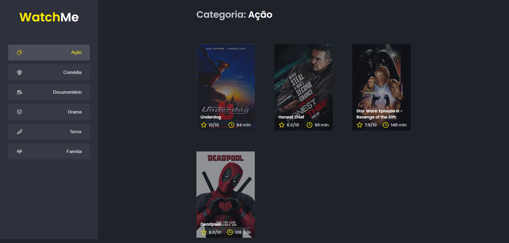

<h1 align="center" style="color:#FAE800">WatchMe</h1>
<h2 align="center">Rocketseat - Ignite - ReactJS</h2>

<h3 align="center">Chapter #1 - Challenge #2</h3>

  <a href="#-Project">Project</a>&nbsp;&nbsp;&nbsp;|&nbsp;&nbsp;&nbsp;
  <a href="#%EF%B8%8F-features">Features</a>&nbsp;&nbsp;&nbsp;|&nbsp;&nbsp;&nbsp;
  <a href="#-Technologies">Technologies</a>&nbsp;&nbsp;&nbsp;|&nbsp;&nbsp;&nbsp;
  <a href="#-How-to-execute">How to execute</a>&nbsp;&nbsp;&nbsp;|&nbsp;&nbsp;&nbsp;
  <a href="#-Licence">Licence</a>

  

## 💻 Project

WatchMe is a app to list you favourite movies. This is a challenge of ReactJS track of Ignite course from [Rocketseat](https://rocketseat.com.br/).

## 🛠️ Features

- [x] List movies
- [x] Filter by genre

## ✨ Technologies

This project was developed with the technologies above:

- [React](https://reactjs.org)
- [TypeScript](https://www.typescriptlang.org)
- [Babel](https://babeljs.io/)
- [Webpack](https://webpack.js.org/)
- [JSON Server](https://github.com/typicode/json-server)

## 🚀 How to execute

- Clone the repository
- Install de dependencies with `yarn`
- Run the server with `yarn server`
- Run the application with `yarn dev`
- Access [`localhost:8080`](http://localhost:8080) in your browser

## 📄 Licence

This project is under the MIT license. See the [LICENSE](./LICENSE) file for more details.

---

Feito com ♥ by Samael Melo and Rocketseat
